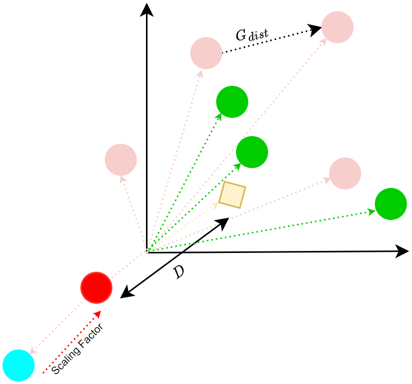
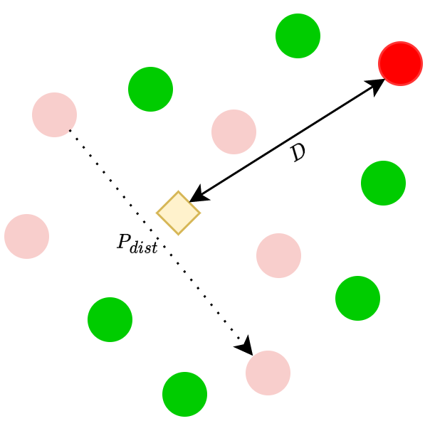
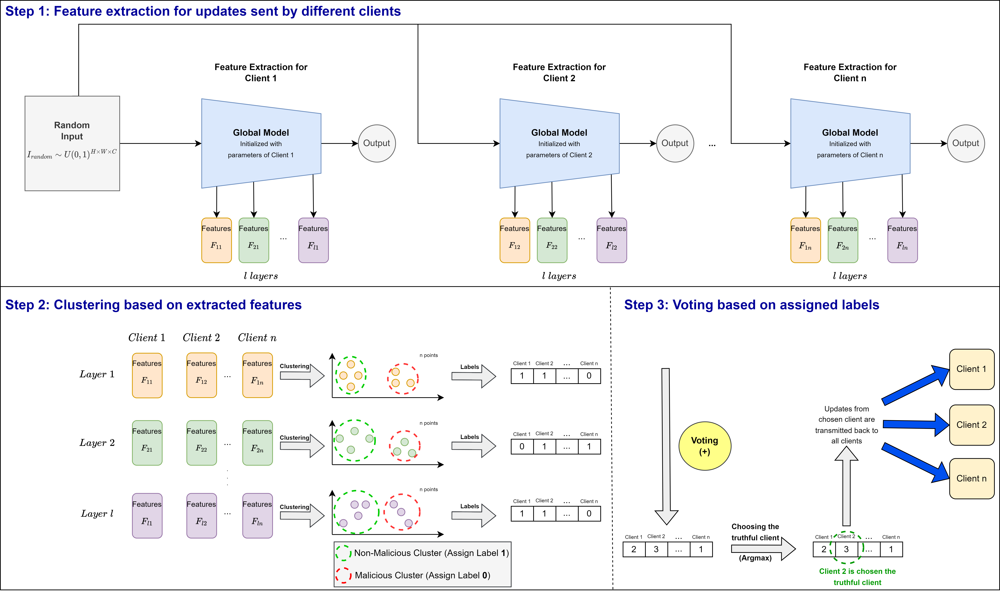

# Federated Learning Research Repository

This repository contains two essential works in the federated learning paradigm, namely:  
a) [**DISBELIEVE Attack**](https://arxiv.org/abs/2308.07387)  
b) **GAMMA Aggregation Method**

---

## 1. DISBELIEVE Attack

<table>
  <tr>
    <td align="center" width="45%">
      
    </td>
    <td style="border-left: 2px solid #999; height: auto;" width="2%"></td>
    <td align="center" width="45%">
      
    </td>
  </tr>
</table>
---

## 2. GAMMA Aggregation Method

<p align="center">
  
</p>

---

## 3. Running the Experiments

To run the experiments, simply execute:

```bash
python main.py
